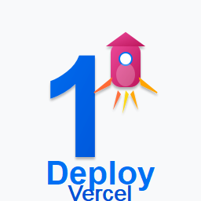

# EkClick - One-Click Deployment for Vercel



> Deploy your web projects to Vercel **directly from VS Code** with a single command.

Built with ❤️ by [Pradeep Awasthi](https://github.com/pradeep-gif-hub) - Simplifying deployment for students and developers.

---

## ✨ What is EkClick?

EkClick eliminates the complexity of deployment. No more terminal commands, no more confusion. Just open your project in VS Code and deploy in seconds.

**Perfect for:**
- 🎓 Students deploying their first project
- 👨‍💻 Developers who want quick deployments
- 🚀 Anyone tired of CLI deployment commands

---

## 🚀 Quick Start (3 Steps)

### Step 1️⃣ Install Requirements
```bash
# Install Vercel CLI globally
npm install -g vercel

# Authenticate with your Vercel account
vercel login
```

### Step 2️⃣ Install EkClick
1. Open VS Code
2. Go to **Extensions** (`Ctrl+Shift+X`)
3. Search for **"EkClick"**
4. Click **Install**

### Step 3️⃣ Deploy Your Project
1. Open your project in VS Code
2. Press `Ctrl+Shift+P` (or `Cmd+Shift+P` on Mac)
3. Type **"EkClick Deploy to Vercel"** and press Enter
4. Watch your project deploy in real-time! 🎉

---

## ✨ Key Features

- **🎯 One-Click Deploy** - Deploy from VS Code without terminal
- **🔍 Auto-Detection** - Recognizes Next.js, Vite, and Static projects
- **📊 Live Logs** - See deployment progress in real-time
- **🔗 Quick Actions** - Copy URL or open deployment instantly
- **✅ Smart Validation** - Checks for Vercel CLI automatically
- **🛡️ Clear Errors** - Helpful messages when something goes wrong

---

## 📋 Requirements

- **VS Code** v1.85.0 or higher
- **Node.js** (Latest LTS)
- **Vercel CLI** - [Install](https://vercel.com/docs/cli)
- **Vercel Account** - [Free signup](https://vercel.com/signup)

---

## 📖 How to Use

### First Time Setup
```bash
# 1. Login to Vercel (run once)
vercel login

# 2. In your project directory
cd my-project
code .
```

### Deploy Your Project
1. Open Command Palette: `Ctrl+Shift+P`
2. Find: "EkClick Deploy to Vercel"
3. Press Enter
4. Your deployment URL appears in the notification!

### Supported Projects

| Project Type | Requirements |
|---|---|
| **Next.js** | Must have `next.config.js` |
| **Vite** | Must have `vite.config.ts` or `vite.config.js` |
| **React/Vue/Static** | Any other frontend project with `index.html` |

---

## 🛠️ Troubleshooting

### ❌ "Vercel CLI not found"
```bash
npm install -g vercel
vercel login
```

### ❌ Deployment fails
1. Check the **"EkClick"** output channel for error details
2. Run `npm install` in your project
3. Test locally: `npm run build`
4. Check your `vercel.json` configuration

### ❌ Can't find the command
- Reload VS Code: `Ctrl+Shift+P` → "Reload Window"
- Make sure extension is enabled in Extensions view
- Restart VS Code

---

## 🎓 First-Time Deployment Guide

**You're about to deploy your first project—awesome!** Here's what happens:

1. **EkClick detects** your project type automatically
2. **Vercel builds** your project (takes 30-60 seconds usually)
3. **Your live URL** appears instantly
4. **Share with anyone!** Your project is now on the internet 🎉

### Tips for Success
- ✅ Commit your code to Git before deployment
- ✅ Ensure all dependencies are installed (`npm install`)
- ✅ Test build locally first (`npm run build`)
- ✅ Check environment variables in `vercel.json` if needed

---

## ⚙️ Advanced Configuration

Create a `vercel.json` file in your project root for custom settings:

```json
{
  "buildCommand": "npm run build",
  "outputDirectory": "dist",
  "env": {
    "API_KEY": "@api_key"
  }
}
```

---

## 🔄 Updates & New Features

**Current Version:** v1.0.2

**Coming Soon:**
- 📱 Preview deployments
- 📊 Deployment history
- 🎨 Custom domain support
- ⚡ Build performance metrics
- 🔔 Smart notifications

---

## 💡 Need Help?

- 📖 **[Vercel Docs](https://vercel.com/docs)** - Official documentation
- 🎓 **[Next.js Guide](https://nextjs.org/learn)** - Learn Next.js
- 🌐 **[Vite Guide](https://vitejs.dev/guide/)** - Vite documentation
- 🐛 **[Report Issues](https://github.com/pradeep-gif-hub/EkClick/issues)** - Found a bug?

---

## 📞 Support & Community

- **Found a bug?** → [Open an issue](https://github.com/pradeep-gif-hub/EkClick/issues)
- **Have an idea?** → [Suggest a feature](https://github.com/pradeep-gif-hub/EkClick/issues/new)
- **Need help?** → [Start a discussion](https://github.com/pradeep-gif-hub/EkClick/discussions)
- **Like it?** → [⭐ Star on GitHub](https://github.com/pradeep-gif-hub/EkClick)

---

## 🤝 Contributing

EkClick is open-source! Contributions welcome.

```bash
git clone https://github.com/pradeep-gif-hub/EkClick.git
cd EkClick
npm install
npm run compile
```

Press `F5` to test in development mode.

---

## 📁 Project Structure

```
EkClick/
├── src/extension.ts        # Main extension logic
├── src/deploy.ts           # Vercel integration
├── src/detectProject.ts    # Project detection
├── dist/                   # Compiled output
├── icon.png               # Extension icon
└── README.md              # This file
```

---

## 📄 License

MIT License - Free to use and modify

---

## 🎓 A Message to Students

Deploying your first project is a **huge milestone**. You're not just learning to code—you're shipping it to the world! 

EkClick is built to make this moment stress-free. Just focus on building great things, and let EkClick handle the deployment.

**Remember:**
- 🎯 Start small, ship fast
- 📊 Monitor your deployments
- 🧠 Learn from the logs
- 🚀 Don't be afraid to iterate

**You've got this!** 💪

---

**Made by a developer for developers. Happy deploying! 🚀**
